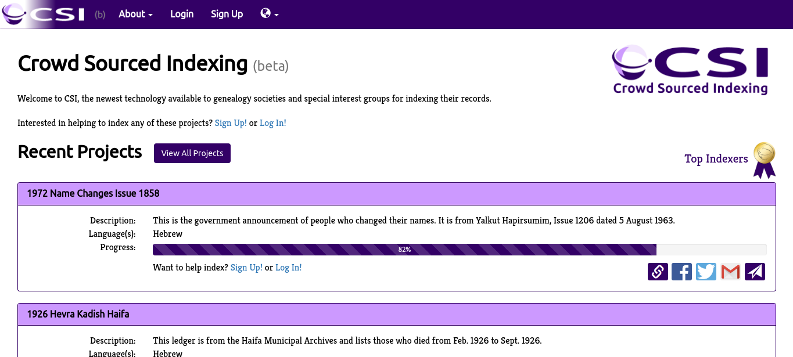

# Welcome To The Temple Of Indexing. 

Crowdsourcing involves obtaining work, information, or opinions from a large group of people who submit their work through the Internet, social media, and phone.
Now you might be wondering, "Hasnt this already been done before?". You'd be right but its very outdated and barren. 

(https://csindexing.com/) **2006**

(our ss's of temple indexing.)

### Where Can I Sign Up?
Start your next post with us! (website link)

### Learn More
(link)
(link)
